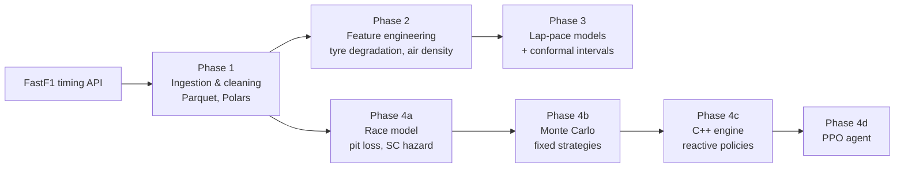

# PitWallML: F1 Telemetry, Lap-Pace Models & Race-Strategy Simulation

End-to-end machine learning and stochastic simulation on real Formula 1 timing data: from raw
FastF1 telemetry to leakage-free features, benchmarked lap-pace models with **conformal prediction
intervals**, a **Monte Carlo strategy engine in C++20** (pybind11), and a **reinforcement-learning
pit-stop agent**, all validated against simple baselines on identical data.


---

## Key results

| Question | Method | Result |
|---|---|---|
| Can we predict lap pace better than "same as recent form"? | CatBoost (Huber loss) vs Ridge, PyTorch MLP and a naive persistence baseline, chronological race split | **MAE −8.3 %** vs baseline (0.418 s vs 0.456 s); the MLP does *not* beat the baseline |
| Are the uncertainty estimates trustworthy? | Hand-written split conformal prediction, cross-checked against MAPIE (identical to 0.0 s) | **93.6–95.6 %** empirical coverage for a 95 % target, on unseen races |
| Which pit strategy is fastest under Safety Car risk? | Monte Carlo over every 1- and 2-stop plan, stochastic SC model estimated from the 2023 season | 3,654 strategies × 2,000 races in **1.4 s**; common random numbers cut the std of strategy comparisons **30×** (166 s → 5.6 s) |
| Does reacting to the Safety Car beat a fixed plan? | Rule-based reactive policies, grid-searched in C++ | **−0.52 s per race** on average, **−1.05 s** in races with a SC; the advantage grows with SC frequency |
| How fast is the C++ engine? | C++20 core with zero-copy NumPy buffers, GIL released | **~245× faster** than the Python reference, ~3× faster than NumPy, identical results to 1e-12 s; **4.6×** further with 8 threads |
| Can an RL agent learn strategy from scratch? | PPO (stable-baselines3) in a custom Gymnasium environment | Beats the best fixed plan (−0.34 s/race) and **independently rediscovers** the structure of the best hand-written rule |

---

## Pipeline



### Phase 1: Data ingestion
- Loads race sessions with [FastF1](https://github.com/theOehrly/Fast-F1) behind an on-disk HTTP cache; one Parquet file per race with explicit nullable and categorical dtypes.
- Weather is attached to each lap with `pd.merge_asof` on the **lap start time**, never a later sample, so no future information leaks into a lap's features.
- Season-level lazy scanning with Polars; the full 2023 season is 22 races, 24.4k laps (20.7k after cleaning).

### Phase 2: Domain feature engineering
- **Fuel-corrected lap time**, separating tyre wear from the car getting lighter.
- **Tyre degradation index:** a rolling least-squares slope of pace vs tyre age, fully vectorised (cov/var from four lagged rolling means), computed only from *previous* laps of the same stint.
- **Moist-air density and downforce index** (ideal-gas model with Tetens vapour pressure), track-temperature drift since the stint started, and micro-sector time deltas from telemetry via `np.interp`.
- Tests change a single lap's time and assert that no feature at or before that lap changes (**target leakage**).

### Phase 3: Model benchmark with conformal prediction
- Target: how much slower or faster the next lap is than the driver's recent pace on the same tyres.
- **Chronological whole-race split**: train → validation (early stopping) → calibration (conformal only) → test, so no race is ever in two sets.
- Models: naive persistence, Ridge, CatBoost, PyTorch MLP (custom training loop with early stopping, sklearn-compatible wrapper). Preprocessing is fitted on training races only.
- **Split conformal prediction** implemented from first principles, verified against MAPIE. The notebook also shows *where* the guarantee breaks: Las Vegas 2023 (a new street circuit, far colder than any training race) drops to 74–85 % coverage, a distribution shift the method makes visible.

### Phase 4: Strategy simulation and decision-making
- **Race model:** green-flag pit loss from paired in-/out-laps, a Safety Car hazard (0.0136 deployments/lap, mean 3.7 laps) pooled over the season, and robust lap noise (scaled MAD).
- **Monte Carlo engine** (NumPy): random SC periods and lap noise, every legal strategy simulated on the *same* random races (common random numbers, a variance-reduction technique).
- **C++20 / pybind11 port:** pure C++ cores on raw pointers, zero-copy access to NumPy buffers, the GIL released for multi-threaded use, input validation at the boundary, and parity tests against the Python reference.
- **Reactive policies:** a planned stop that is brought forward when a Safety Car appears within a window. NumPy cannot vectorise this per-race branching; C++ evaluates a 2,016-policy grid on 4,000 races in 0.6 s.
- **Reinforcement learning:** a Gymnasium environment (one step = one lap) whose physics are tested to match the simulators exactly, and a PPO agent tuned through a documented hyperparameter comparison.

---

## Engineering and validation practices

- **150 pytest tests** covering data cleaning, leakage, numerical parity (C++ vs Python vs NumPy to `rtol=1e-12`), statistical properties (SC frequency vs renewal theory) and API contracts (Gymnasium `check_env`).
- **Baselines everywhere:** every model is compared with the simplest sensible alternative on identical data.
- **Reference implementations:** fast code (C++, vectorised NumPy) is always checked against a slow, readable reference.
- **Reproducibility:** seeded random generators, cached data, deterministic splits, and trained models saved with their learning curves.
- **Documented limitations** (below): negative and partial results are reported, not removed.

---

## Notebooks

| Notebook | Content |
|---|---|
| [`01_fastf1_eda`](notebooks/01_fastf1_eda.ipynb) | What FastF1 provides: lap, weather and telemetry tables, tyre strategies, race traces |
| [`02_feature_visual_checks`](notebooks/02_feature_visual_checks.ipynb) | Every Phase 2 feature on a real race, plus a live leakage check and the full-season build |
| [`03_model_benchmark`](notebooks/03_model_benchmark.ipynb) | Model comparison, feature importance, early stopping, conformal coverage per race and per compound |
| [`04_strategy_monte_carlo`](notebooks/04_strategy_monte_carlo.ipynb) | Race-model fitting, simulated vs real Safety Cars, strategy ranking, SC sensitivity |
| [`05_cpp_reactive_strategies`](notebooks/05_cpp_reactive_strategies.ipynb) | C++ parity and speed, zero-copy and GIL experiments, fixed vs reactive strategies |
| [`06_rl_pit_strategy`](notebooks/06_rl_pit_strategy.ipynb) | PPO training, head-to-head on 4,000 races, what the agent learned |

---

## Quickstart

Requires Python ≥ 3.11, CMake ≥ 3.18 and a C++20 compiler (clang, gcc or MSVC).

```bash
git clone https://github.com/KonWas/pitwall-ml.git && cd pitwall-ml
python -m venv .venv && source .venv/bin/activate
pip install -e ".[dev,notebooks]"

# Download and process the 2023 season (first run: a few minutes; cached afterwards)
python -c "from src.data.season import build_season; from src.features.season_features import build_season_features; build_season(2023); build_season_features()"

# Build the C++ simulator
python -m src.cpp.build

# Run the test suite
pytest -q                     # all tests
pytest -q -m "not network"    # offline only
```

Register the kernel for the notebooks with
`python -m ipykernel install --user --name pitwall-ml --display-name "Python (pitwall-ml)"`.

---

## Project structure

```
src/
├── data/                  ingestion.py, season.py          FastF1 → Parquet, season calendar, Polars scans
├── features/              build_features.py, season_features.py, preprocessing.py
├── models/
│   ├── dataset.py         target, chronological race split, feature matrices
│   ├── conformal.py       split conformal prediction + MAPIE cross-check
│   ├── benchmark.py       fit → calibrate → evaluate, identical for every model
│   ├── baselines/         naive, Ridge, race_model, monte_carlo, reactive
│   └── advanced/          CatBoost, PyTorch MLP, Gymnasium env, PPO agent
└── cpp/                   simulator.cpp (C++20 + pybind11), CMakeLists.txt, build.py, sim.py
tests/                     150 tests, one file per module
notebooks/                 01–06, one per phase
```

---

## Limitations and honest findings

- **Sim-to-real gap.** Race data alone cannot identify how much faster a new soft tyre is, because teams *choose* strategies that make the compounds roughly equal and drivers manage their tyres (selection bias). Strategies optimised on data-fitted parameters were unrealistic, and adding a track-evolution term or priors only partly helped. Strategy results are therefore reported on a **reference race** with realistic, hand-set tyre parameters: they compare *methods*, not real-world recommendations.
- **Small effects, large noise.** Lap-pace features explain only a small share of lap-to-lap variation (traffic, DRS, driver behaviour are not in the data), and a single Safety Car moves a race by ~40 s, while a good strategy decision is worth ~1 s. Every result is measured on thousands of races or on held-out races, never a single one.
- **One season.** Phase 3 is evaluated on 4 held-out races; more seasons would tighten the comparison.
- **The RL agent does not beat the best hand-written rule** (−0.34 s vs −0.52 s per race against the best fixed plan). In a race model this simple, a two-parameter rule captures the optimum. RL becomes the better tool once the state is richer (gaps to rivals, traffic, opponents' strategies) than any rule can encode.

## Roadmap
- [x] Phases 1–4: data → features → models with uncertainty → simulation, C++ engine, RL
- [ ] Phase 5: interactive Streamlit dashboard (live strategy trees, telemetry overlays) and experiment tracking with Weights & Biases

## Tech stack
**Data:** FastF1, pandas, Polars, PyArrow · **ML:** scikit-learn, CatBoost, PyTorch, MAPIE ·
**Simulation & RL:** NumPy, C++20, pybind11, CMake, Gymnasium, stable-baselines3 ·
**Quality:** pytest, Jupyter, matplotlib

---

*Author: [KonWas](https://github.com/KonWas)*
